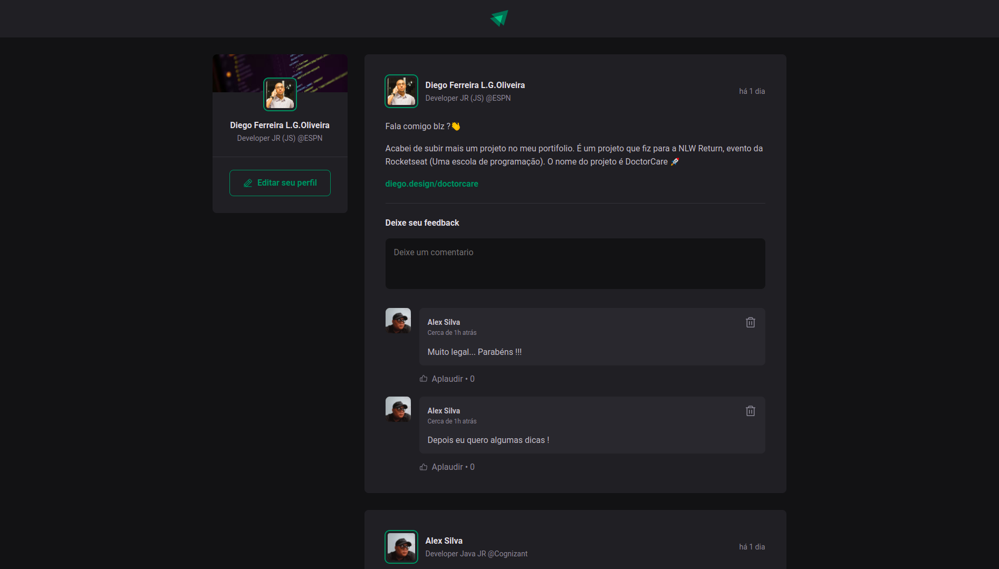

<h1 align="center">
    
</h1>

# Ignite Feed

Essa aplicação foi construida durante o primeiro capitulo da nova trilha do React.JS do bootcamp Ignite.

O sistema tem como objetivo simular uma rede social como por exemplo o Facebook. O software possui a funcioanlidade de adcionar, excluir e curtir um comentário.

A aplicação (https://github.com/diego64/ignite_feed) foi refatorada inserindo TypeScript.

## Stack utilizada

- [React.JS](https://pt-br.reactjs.org/)
- [Vite](https://vitejs.dev/guide/#trying-vite-online)


## Rodando localmente

Clone o projeto

```bash
  git clone https://github.com/diego64/ignite_feed
```

Entre no diretório do projeto

```bash
  cd ignite_feed
```

Instale as dependências

```bash
  npm install
```

Inicie o servidor

```bash
  npm run dev
```
## Aprendizados

- Fundamentos do ReactJS
- Bundlers & Compilers
- Criação de um projeto React
- Componentes
- Propriedades
- CSS Modules
- Entendendo a propiedade key
- Comunicação entre componentes